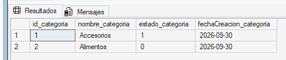
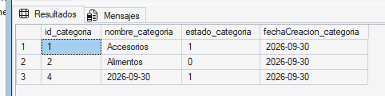
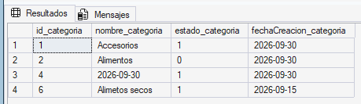
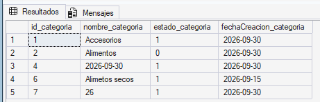
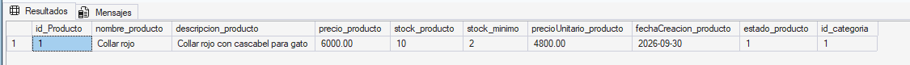
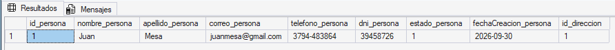

# Pruebas de Validación


## Ingreso de datos válidos para las tablas categoría, producto y persona:


* Ingreso de datos válidos en la tabla categoria con nombre y estado.


**Código SQL:** 
```
INSERT INTO CATEGORIA (nombre_categoria, estado_categoria)
VALUES 
    ('Accesorios', 1),
    ('Alimentos', 0); 
```



* Ingreso de una fecha en nombre_categoria, hay una conversión automática de valores date a varchar.

**Código SQL:** 
```
INSERT INTO CATEGORIA (nombre_categoria, estado_categoria)
VALUES ('2026-09-30', 1);
```


* Ingreso con fecha de creación manual en categoria.

**Código SQL:** 
```
INSERT INTO CATEGORIA (nombre_categoria, estado_categoria, fechaCreacion_categoria)
VALUES ('Alimetos secos', 1, '2026-09-15'); 
```


* Ingreso de un valor int en nombre_categoria, hay una conversión automática de int a varchar.

**Código SQL:** 
```
INSERT INTO CATEGORIA (nombre_categoria, estado_categoria)
VALUES (26, 1); 
```


* Ingreso de datos válidos en la tabla producto.

**Código SQL:** 
```
INSERT INTO PRODUCTO(nombre_producto, descripcion_producto, precio_producto, stock_producto, stock_minimo, 
precioUnitario_producto, estado_producto, id_categoria)
VALUES ('Collar rojo', 'Collar rojo con cascabel para gato', 6000, 10, 2, 4800, 1, 1); ```
```



* Ingreso de datos válidos en la tabla persona.

**Código SQL:** 
```
INSERT INTO PERSONA(nombre_persona, apellido_persona, correo_persona, telefono_persona, dni_persona, estado_persona, id_direccion)
VALUES ('Juan', 'Mesa', 'juanmesa@gmail.com', '3794-483864', 39458726, 1, 1);
```


## Carga de datos inválidos y sus respectivos errores.


### Error de tipo de dato


1. Se trata de cargar un valor para id_categoria que está definido como identity.

**Código SQL:** 
```
INSERT INTO CATEGORIA (id_categoria, nombre_categoria, estado_categoria)
VALUES (4, 'Juguetes', 1); 
```

**Mensaje de error**: No se puede insertar un valor explícito en la columna de identidad de la tabla 'CATEGORIA' cuando IDENTITY_INSERT es OFF.


2. Se trata de ingresa un valor Null en nombre aunque sea un dato NOT NULL.

**Código SQL:** 
```
INSERT INTO CATEGORIA (nombre_categoria, estado_categoria)
VALUES  (NULL, 1); 
```

**Mensaje de error**: No se puede insertar el valor NULL en la columna 'nombre_categoria', tabla 'PETSHOPDELLITORAL.dbo.CATEGORIA'. La columna no admite valores NULL. Error de INSERT.


3. Se trata de ingresar un estado que no es 1 o 0.

**Código SQL:** 
```
INSERT INTO CATEGORIA (nombre_categoria, estado_categoria)
VALUES ('Salud', 5); 
```

**Mensaje de error**: Instrucción INSERT en conflicto con la restricción CHECK 'CK_ESTADO_CATEGORIA'. El conflicto ha aparecido en la base de datos 'PETSHOPDELLITORAL', tabla 'dbo.CATEGORIA', column 'estado_categoria'.


4. Se trata de ingresar un valor int en fecha de creación.

**Código SQL:** 
```
INSERT INTO CATEGORIA (nombre_categoria, estado_categoria, fechaCreacion_categoria)
VALUES ('Alimetos húmedos', 1, 2026); 
```

**Mensaje de error**: Conflicto de tipos de operandos: int es incompatible con date.

### Error de clave foránea (FK)

5. Se trata de ingresar un producto con una categoría que no existe.  

**Código SQL:**
```
INSERT INTO PRODUCTO(nombre_producto, descripcion_producto, precio_producto, stock_producto, stock_minimo, 
precioUnitario_producto, estado_producto, id_categoria)

VALUES('Collar azul', 'Collar azul con cascabel para gato', 6000, 10, 2, 4800, 1, 14); 
```

**Mensaje de error**: Instrucción INSERT en conflicto con la restricción FOREIGN KEY 'FK_CATEGORIA'. El conflicto ha aparecido en la base de datos 'PETSHOPDELLITORAL', tabla 'dbo.CATEGORIA', column 'id_categoria'.

### Error de check

6. Se trata de ingresar un precio unitario menor o igual que cero.

**Código SQL:** 
```
INSERT INTO PRODUCTO(nombre_producto, descripcion_producto, precio_producto, stock_producto, stock_minimo,
precioUnitario_producto, estado_producto, id_categoria)

VALUES('Collar amarillo', 'Collar amarillo con cascabel para gato', 6000, 10, 2, -800, 1, 1); 
```

**Mensaje de error**: Instrucción INSERT en conflicto con la restricción CHECK 'CK_PRECIO_UNIT'. El conflicto ha aparecido en la base de datos 'PETSHOPDELLITORAL', tabla 'dbo.PRODUCTO', column 'precioUnitario_producto'.


7. Se trata de ingresar un stock mínimo negativo.

**Código SQL:** 
```
INSERT INTO PRODUCTO(nombre_producto, descripcion_producto, precio_producto, stock_producto, stock_minimo,
precioUnitario_producto, estado_producto, id_categoria)
VALUES('Collar verde', 'Collar verde con cascabel para gato', 6000, 10, -4, 4800, 1, 1); 
```

**Mensaje de error:** Instrucción INSERT en conflicto con la restricción CHECK 'CK_STOCK_MIN'. El conflicto ha aparecido en la base de datos 'PETSHOPDELLITORAL', tabla 'dbo.PRODUCTO', column 'stock_minimo'.

### Error de unicidad

8. Se trata de ingresar un registro con un correo ya utilizado en otra fila.

**Código SQL:** 
```
INSERT INTO PERSONA(nombre_persona, apellido_persona, correo_persona, telefono_persona, dni_persona, estado_persona, id_direccion)
VALUES ('Maria', 'Ramirez', 'juanmesa@gmail.com', '3795-483864', 28458777, 1, 1); 
```

**Mensaje de error:** Infracción de la restricción UNIQUE KEY 'UQ_CORREO_PERSONA'. No se puede insertar una clave duplicada en el objeto 'dbo.PERSONA'. El valor de la clave duplicada es (juanmesa@gmail.com).

9. Se trata de ingresar un registro con un teléfono ya utilizado en otra fila.

**Código SQL:** 
```
INSERT INTO PERSONA(nombre_persona, apellido_persona, correo_persona, telefono_persona, dni_persona, estado_persona, id_direccion)
VALUES ('Maria', 'Ramirez', 'mariaRamirez@gmail.com', '3794-483864', 27458888, 1, 1); 
```

**Mensaje de error:** Infracción de la restricción UNIQUE KEY 'UQ_TELEFONO_PERSONA'. No se puede insertar una clave duplicada en el objeto 'dbo.PERSONA'. El valor de la clave duplicada es (3794-483864).


10. Se trata de ingresar un registro con un dni ya utilizado en otra fila.

**Código SQL:** 
```
INSERT INTO PERSONA(nombre_persona, apellido_persona, correo_persona, telefono_persona, dni_persona, estado_persona, id_direccion)
VALUES ('Maria', 'Ramirez', 'mariaRamirez@gmail.com', '3795-483864', 39458726, 1, 1); 
```

**Mensaje de error:** Infracción de la restricción UNIQUE KEY 'UQ_DNI_PERSONA'. No se puede insertar una clave duplicada en el objeto 'dbo.PERSONA'. El valor de la clave duplicada es (39458726).

